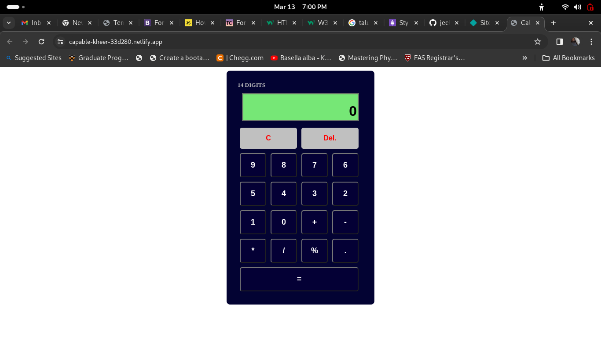

# Calculator

The calculator application created by JS-DOM and for styling css is used. This calculator recives both keyboard and On screen click inputs and performs basic arithmatic operations.

## Table of Contents

- [Introduction](#introduction)
- [Project Images](#Images)
- [Installation](#installation)
- [Usage](#usage)
- [License](#license)

## Introduction

This calculator's operational limit is upto 14 digits, beyond the limit it will alert the user stick with less digits. If non-numberic keys except some allowed keys are pressed, the user will get an alert.

[Netlify link](https://capable-kheer-33d280.netlify.app/)

## Images

The below images tell about how the homepage looks like and shows its responsivenes

## Installation

No installation is required except a latest web browser.

## Usage

It can be used for basic arithmatic calculations(Here '%' button represents modulus operator not a percentage operator).

## License

MIT License

---
